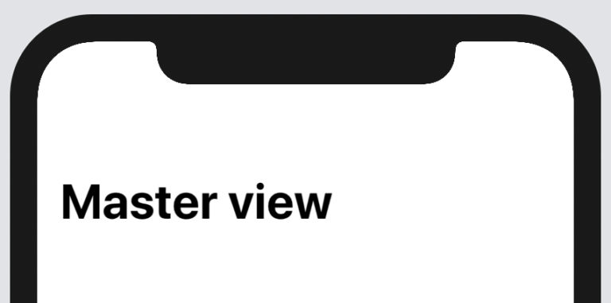
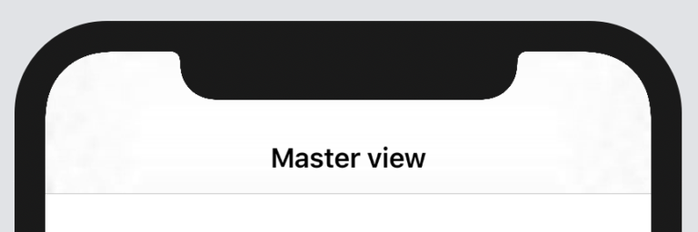
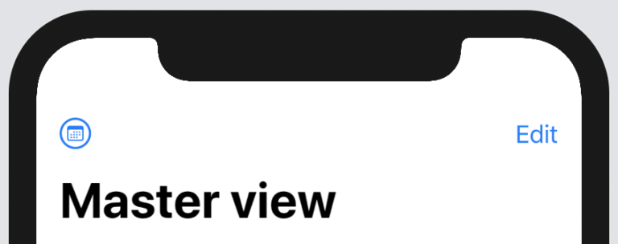
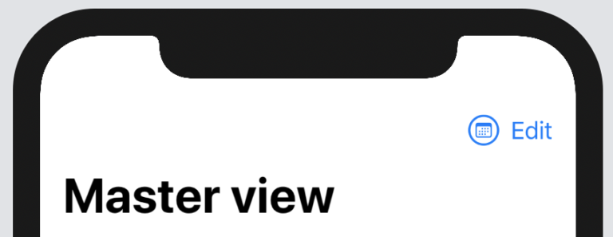
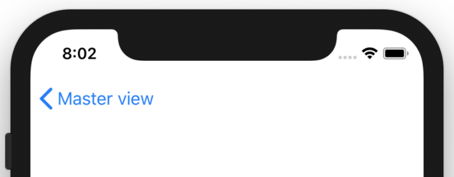
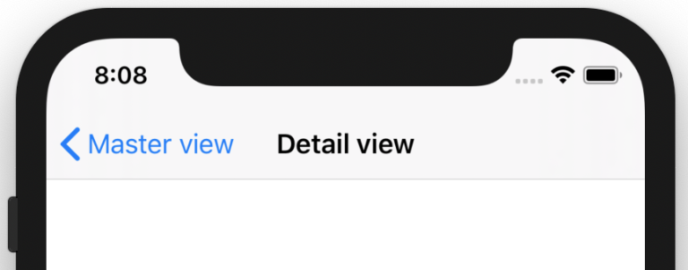

# SwiftUI NavigationView教程与示例
> SwiftUI中的NavigationView是一个容器视图，可让您在导航界面中管理其他视图。了解如何自定义带有标题（大或小）的导航栏，如何在导航栏中添加前导和尾随按钮以及如何实现主从流程，您可以在其中将详细信息视图推入主视图的顶部。

## 创建NavigationView
像这样将视图转换为NavigationView：
````
struct ContentView: View {
    var body: some View {
        NavigationView {
            Text("SwiftUI tutorials")
        }
    }
}
````

向NavigationView添加标题
使用NavigationView内的  navigationBarTitle（）修饰符创建带有标题的导航栏：
````
NavigationView {
    Text("SwiftUI tutorials")
    .navigationBarTitle("Master view")
}
````
## SwiftUI中带有大标题的NavigationView的示例




## 自定义导航栏标题
默认情况下，导航栏标题使用.large显示模式，如上图所示。

将导航栏的标题显示模式更改为.inline以缩小标题：
````
NavigationView {
    Text("SwiftUI tutorials")
    .navigationBarTitle("Master view", displayMode: .inline)
}
````


## 将按钮添加到导航视图
使用navigationBarItems（）修饰符将前导按钮和尾随按钮添加到导航栏中。前导按钮是SF Symbol，尾随按钮是文本：
````
NavigationView {
    Text("SwiftUI tutorials")
    .navigationBarTitle("Master view")
    .navigationBarItems(leading:
            Button(action: {
                print("SF Symbol button pressed...")
            }) {
                Image(systemName: "calendar.circle").imageScale(.large)
            },
        trailing:
            Button(action: {
                print("Edit button pressed...")
            }) {
                Text("Edit")
            }
    )
}
````


您可以使用HStack将多个按钮添加到前导或尾随的条形项目中：
````
NavigationView {
    Text("SwiftUI tutorials")
    .navigationBarTitle("Master view")
    .navigationBarItems(trailing:
        HStack {
            Button(action: {
                print("SF Symbol button pressed...")
            }) {
                Image(systemName: "calendar.circle")
                    .imageScale(.large)
            }
            Button(action: {
                print("Edit button pressed...")
            }) {
                Text("Edit")
            }
        }
    )
}
````


## 如何将新视图推送到NavigationView

为了实现主从流程并在NavigationView的主视图之上显示详细视图，请使用NavigationLink –一个在按下时触发导航演示的按钮：
````
struct DetailView: View {
    var body: some View {
        Text("Detail view")
    }
}

struct ContentView: View {
    var body: some View {
        NavigationView {
            NavigationLink(destination: DetailView()) {
                Text("Show detail view")
            }
            .navigationBarTitle("Master view")
        }
    }
}
````
显示详细视图时，NavigationView会自动处理添加后退按钮的问题。



如果要在详细信息视图中添加标题，请在DetailView主体内部使用  navigationBarTitle（）修饰符：
````
struct DetailView: View {
    var body: some View {
        Text("Detail view")
        .navigationBarTitle("Detail view", displayMode: .inline)
    }
}
````
