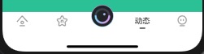

# UGSwiftMagicBox

### 目录

- [UIKit](#UIKit)
    - [UIView](#UIView)
        - [扩展](#扩展)
            - [设置圆角](#设置圆角)
        - [msg](#msg)
        - [loading](#loading)
        - [alert](#alert)
    - [UIButton](#UIButton)
    - [UILable](#UILable)
        - [默认局中的labe](#默认局中的labe)
    - [UITextFied](#UITextFied)
        - [设置UITextFied的placeholder](#设置UITextFied的placeholder)
        - [最大输入长度](#UITextFied)
    - [UIImage](#UIImage)
        - [将image设置透明度后返回](#将image设置透明度后返回)
        - [异步设置任意弧度高性能圆角图片](#异步设置任意弧度高性能圆角图片)
    

- [Foundation](#Foundation)
    - [UIColor](#UIColor)
        - [返回rgba颜色](#返回rgba颜色)
        - [返回随机色](#返回随机色)
        - [颜色生成图片](#颜色生成图片)

    - [UIFont](#UIFont)
    - [String](#String)
    

- [常用功能](#常用功能)
    - [突出的tabbar](#突出的tabbar)
    - [pageView](#pageView)
    - [启动广告](#启动广告)


## UIKit

### UIView

#### 扩展 
##### 设置圆角
```
/**
* radius 圆角数
*/
ug_radius(radius)
```
#### [msg](./UGSwiftMagicbox/Document/msg.md)

项目中常用弹框，在view的顶部或下部弹出，可根据不同的app设置不同的样式样式

#### alert
```
 /**
 * view上弹框
 */
public func alert(aview:UIView)->()
```

### UIButton
### UILable
#### 默认局中的labe
```
UGCentLable 
```
### UITextFied
#### 设置UITextFied的placeholder
```
   /// 设置 placeholder 富文本
    ///
    /// - Parameters:
    ///   - placeholder: 占位符
    ///   - font: 字体
    ///   - color: 颜色
    func setPlaceholder(placeholder: String, font: UIFont?=nil, color: UIColor?=nil) {
```
#### 设置最大输入字数
```
ug_maxlength
```
### UICollectionView
### UIColor

#### 返回rgba颜色
#### 返回随机色
#### 颜色生成图片

### UIFont
### UIImage
#### 1:将image设置透明度后返回 

```
imageWithalpha(_ value:CGFloat) -> UIImage {
 ```

#### 2: 异步设置任意弧度高性能圆角图片
```
cornerImage(size:CGSize, radius:CGFloat, fillColor: UIColor, completion:@escaping ((_ image: UIImage)->())) -> Void {
```
### UIViewcontrooler
### UITabBarViewcontrooler
一个中间按钮凸起的tabbar
### UINavigationController
```
    /**
     * 设置导航栏颜色 默认透明
     */
    public func ug_navigationBar(backgroundImage:UIImage=UIImage(), shadowImage:UIImage=UIImage()) 
```

### String
#### 获取文本高度

## 常用功能

### 突出的tabbar




### pageView


### 启动广告


